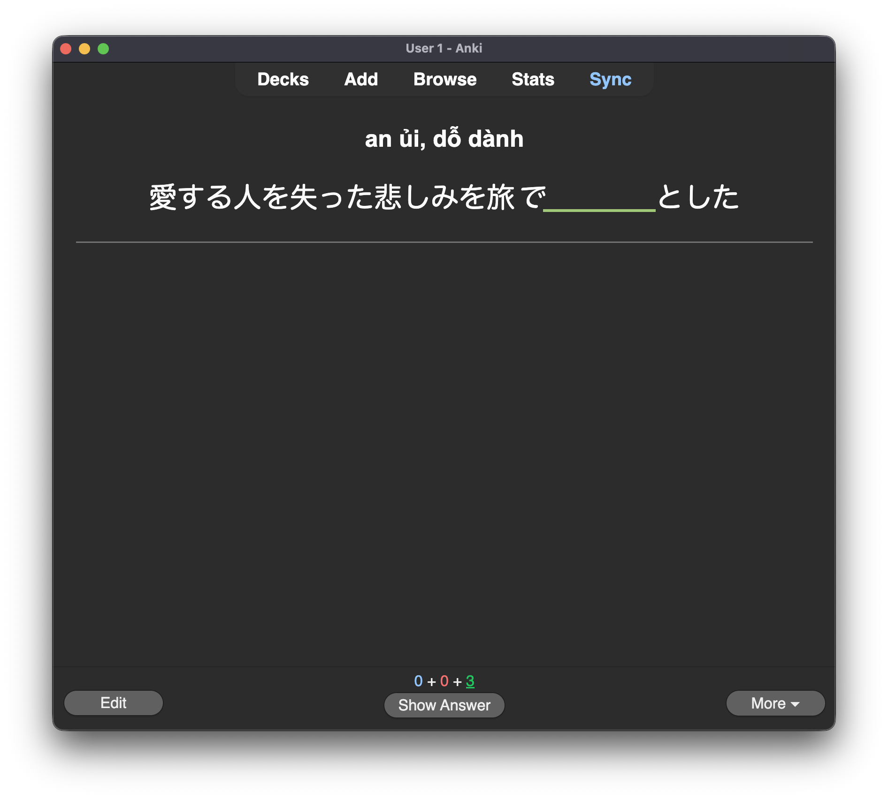
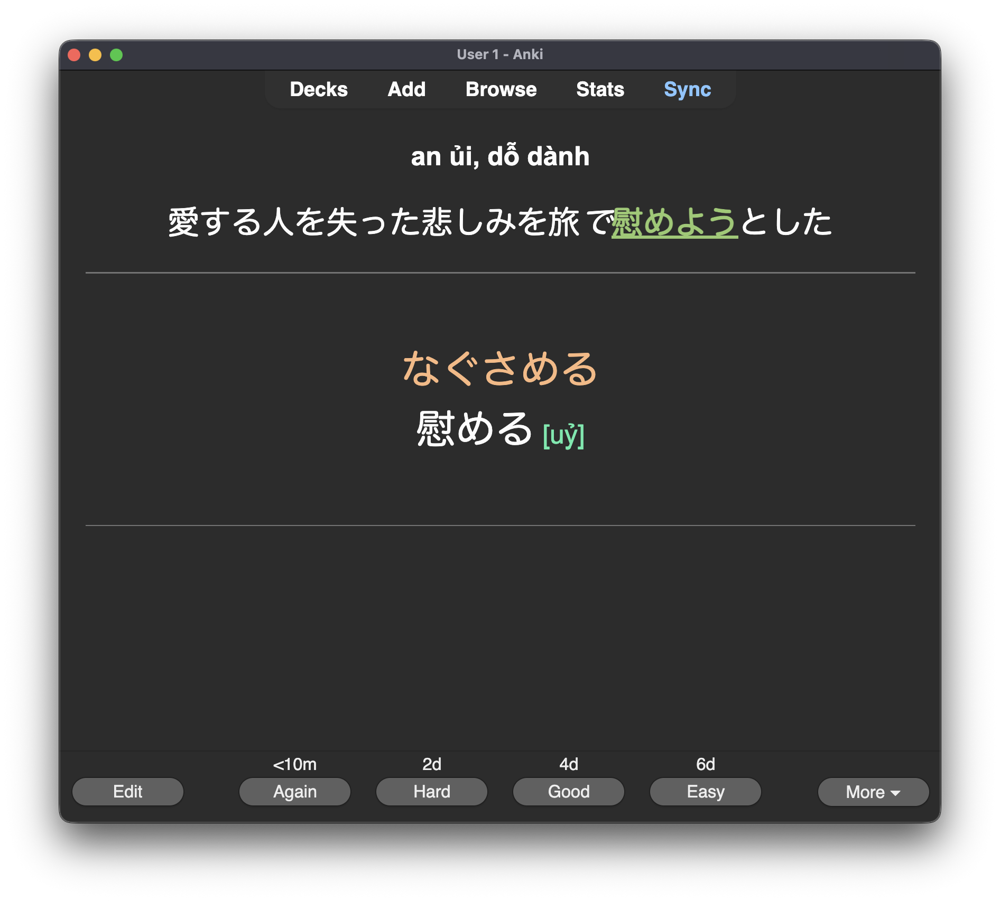

# Anki Generator for Japanese from Random Notes

## The goal

**Automating the creation of Japanese Anki flashcards from handwritten notes.**

An intermediate+ learner's workflow might typically involve watching Japanese content and noting down new words in the wild (and sometimes their context) into a simple text file. Normally, I had to look up each word individually, search for example sentences on Weblio, or prompt an LLM to generate them one by one.

However, as one advances towards N2, the volume of new vocabulary explodes, and manual card creation becomes a burden. Automation is unavoidable.

In my case, the raw notes are quite unstructured and random. Sometimes it's just a word, sometimes a phrase, sometimes with or without additional context, and sometimes with a quick meaning in English or Vietnamese:

```text
別人に成りすます
束縛が強め (bạn gái) kiểm soát nhiều
巻き上げる　rip off money from s.o.
スポットを当てる to bring attention
エラ削り gọt cằm
脂肪吸引
```

I typically separate my Anki cards into **Vocabs** and **Collocations**, using two different decks. This tool handles that separation automatically. You can configure the specific deck names and Note Types in `config.yaml`, as well as map the generated data fields to your specific Anki template structure for each category.

### What this project does

```
+----------------+       +-----------+       +----------------------+
| vocab_list.txt |  -->  |  AnkiGen  |  -->  |  Anki (AnkiConnect)  |
+----------------+       +-----------+       +----------------------+
                               ^
                               |
                               v
                         +-----------+
                         |   Gemini  |
                         +-----------+
```

The workflow is simple:
- Get your random vocabulary notes
- Prompt Gemini to generate the necessary fields for the Anki template **in your desired language**
- Insert into Anki directly (requires AnkiConnect). You can also export it as a JSON file without Anki.

The list of available fields can be found under [Mapping syntax](#mapping-syntax). The prompt is customizable through CLI arguments. The original prompt is in [ankigen/prompt.py](ankigen/prompt.py).

## How to use

1. **Prepare the configuration:**
   See the "Config" section below for details on how to set up your `config.yaml`.

2. **Install the package:**
   ```bash
   cd /path/to/cloned/ankigen
   pip install .
   ```

3. **Get a Gemini API key:**
   Obtain an API key from Gemini (not the GCP API key) and export it in your terminal:
   ```bash
   export GOOGLE_API_KEY="your_api_key_here"
   ```

4. **Run the CLI:**

   **To insert directly into Anki:**
   (Note: You must have [Anki Connect](https://ankiweb.net/shared/info/2055492159) installed and running on your open Anki instance)
   ```bash
   python -m ankigen --input vocab.txt --config config.yaml
   ```

   **To generate a JSON file instead:**
   (Useful if you want to inspect the output before importing)
   ```bash
   python -m ankigen --input vocab.txt --config config.yaml -o output.json
   ```

   **Other options:**
   - `--lang <language>`: Set the target language for meanings and translations (e.g., `english`, `vietnamese`). Default is `vietnamese`.
   - `--jlpt <level>`: Adjust the target difficulty of the generated Japanese example sentences (e.g. `n2`, `n1`).

5. **Sample output:** see [sample_output.json](sample_output.json) (in Vietnamese).

## Config

You must provide a `config.yaml` file to tell the tool how to map the generated data to your specific Anki headers.

### Location

You can provide the path to the config file using the `--config` argument. If not provided, the tool will look for a `config.yaml` file in the default directory:
- Windows: `C:\Users\<YourUsername>\AppData\Roaming\ankigen\config.yaml`
- Linux/Mac: `~/.config/ankigen/config.yaml`

### Required keys
Every key shown in the example below is required. The tool needs to distinguish between "vocab" cards and "collocation" cards, and know which Note Type to use for each. Remember to create the decks in advance before running the tool.

```yaml
decks:
  vocab: N2::Vocab             # Deck name for single words
  collocation: N2::Collocation # Deck name for collocations
templates:
  vocab: 'Your Note Type Name'          # Note Type for single words
  collocation: 'Your Note Type Name'    # Note Type for collocations
mappings:
  vocab:
    # format: <Anki Field Name>: <Generated Key>
    Expression: vocab
    Reading: furigana
    Meaning: meaning
    Example: example
    Translation: example_trans
    HanViet: hanviet
  collocation:
    Expression: vocab
    Reading: furigana
    Meaning: meaning
    Example: example
    Translation: example_trans
    HanViet: hanviet
```

A sample `config.yaml` file is also provided in this repository.

### Mapping syntax
The `mappings` section defines how the LLM output maps to your Anki card fields.
- **Key (Left side):** The exact name of the **Field** in your Anki Note Type.
- **Value (Right side):** The data key generated by this tool.

**The available keys are:**
- `vocab`: The word or phrase itself (exactly as it appeared in your list).
- `furigana`: The reading of the word (hiragana).
- `example`: An example sentence in Japanese.
- `example_trans`: Translation of the example sentence in the desired language. The translation is deliberately prompted to be a bit word-by-word.
- `meaning`: The meaning of the word in the desired language.
- `hanviet`: Han-Viet reading (Vietnamese transcription of the kanji).
  > **Note:** The `hanviet` key is only populated when the tool is run with `--language=vietnamese`.

# How the output can be used




My way is that words shouldn't be learned alone. It's always put inside the context of the **Example sentence**, mainly due to the sheer amount of homonyms at the N3+ level. This is why the front side shows both the meaning and the Japanese sentence with the word covered.

Word covering can be implemented through a CSS trick: **bold** the target word in the example sentence: `愛する人を失った悲しみを旅で<b>慰める</b>`.

Then structure the HTML/CSS similar to:

```html
<section class="hint-hide" id="main-example">
	<div class="big-text example-text fnt-serif">{{Example}}</div>
</section>
```

```css
.hint-hide b {
	color: transparent;
}
```

# Why don't just use e.g. Yomitan with AnkiConnect?

Some might suggest sentence mining by watching anime with Japanese subtitle and use ASBPlayer + Yomitan + AnkiConnect to automatically 1) grab the word and the whole context, 2) look up the dictionary and 3) insert to Anki directly.

To me, the problem with this approach is that:

- Low upfront cost of vocab insertion = large backlog in Anki later

- Good Yomitan dictionaries are mostly in English. I'm tired of learning Japanese already. Do I really have to wrestle with English phrasal verbs too? Nah
  - Yomitan is only used for *quick lookup*
  - Sometimes English expresses a sense better, sometimes my native tongue. It's judged on a case-by-case basis

- Automatically pulling definitions from a dictionary produces too many meaning entries. I want to focus on the specific meaning/word sense that I encountered in the wild

- Sometimes the correct sense only becomes clear after e.g. a Google Images search. I only note down what makes sense in the context I found


# Acknowledgements

This project is vibecoded with Cursor. The Gemini prompt is written manually.